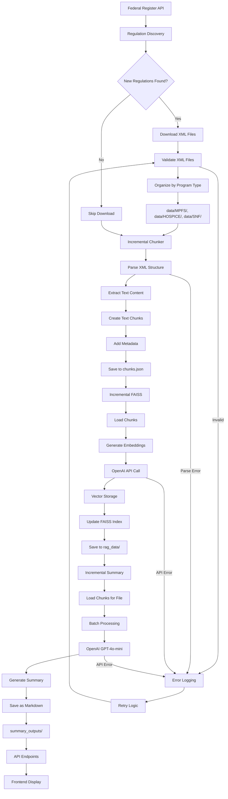
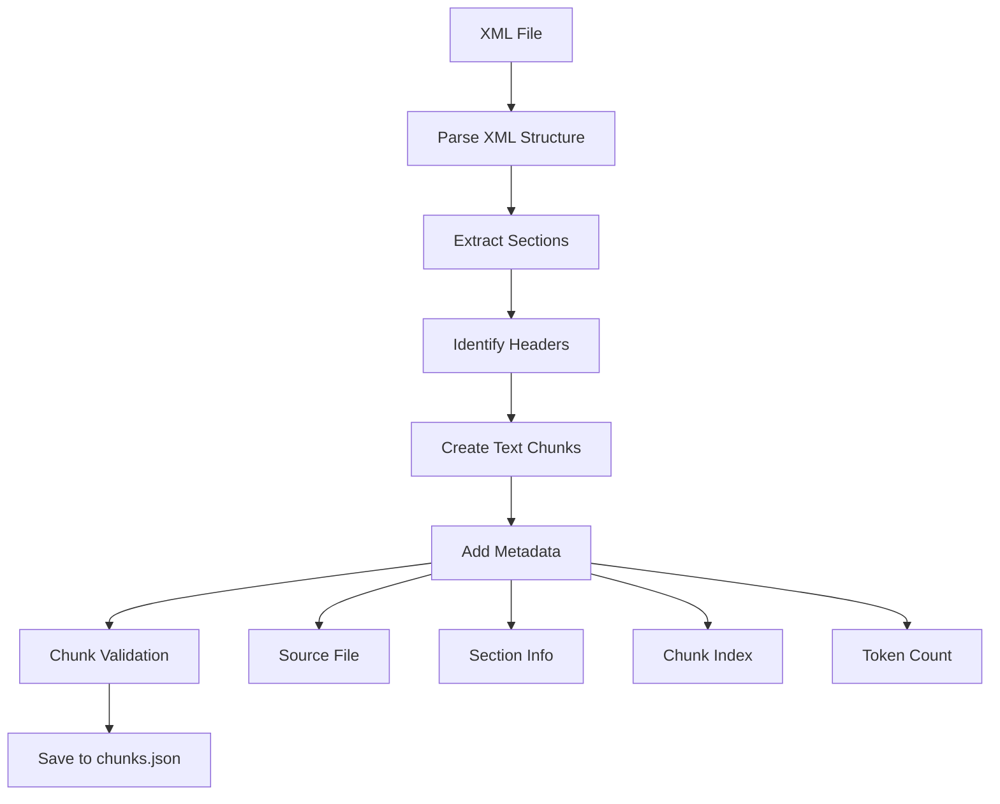
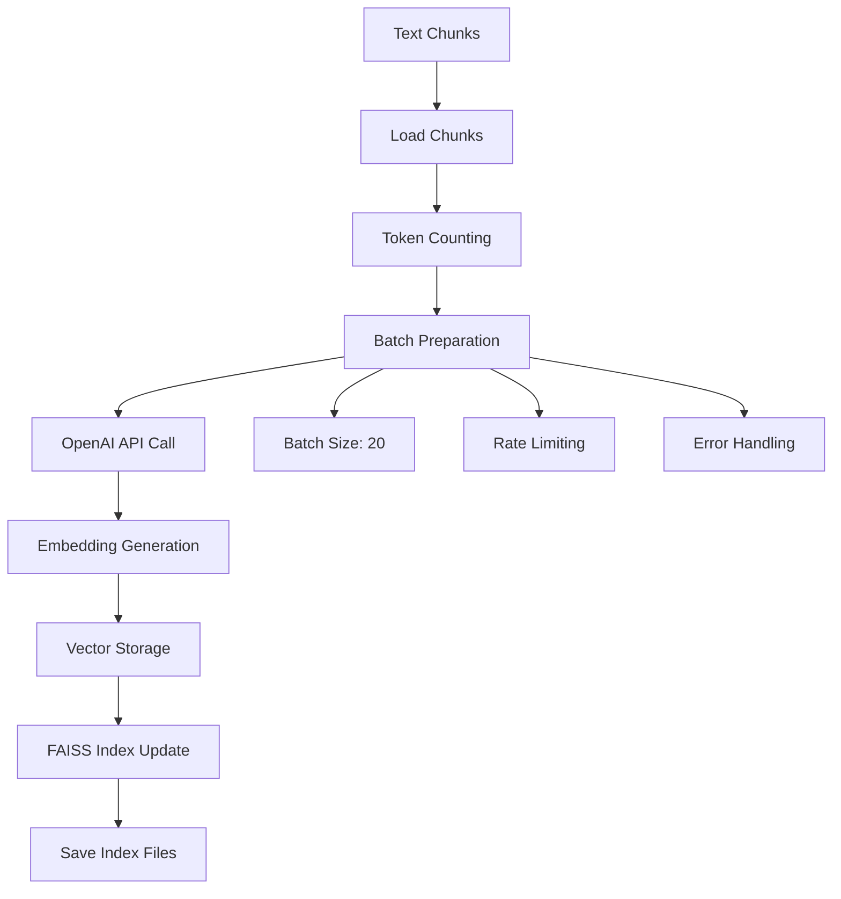
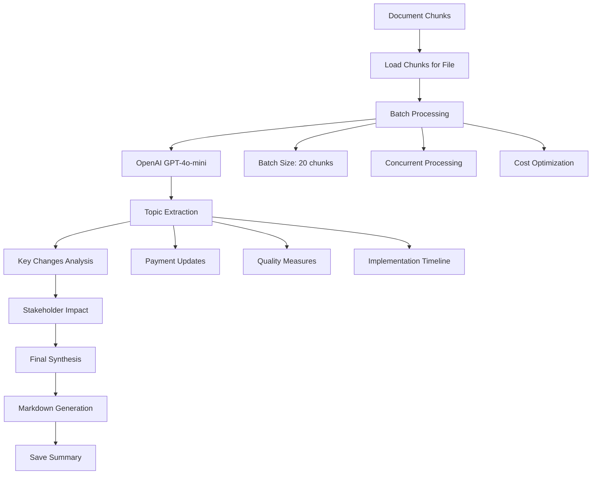
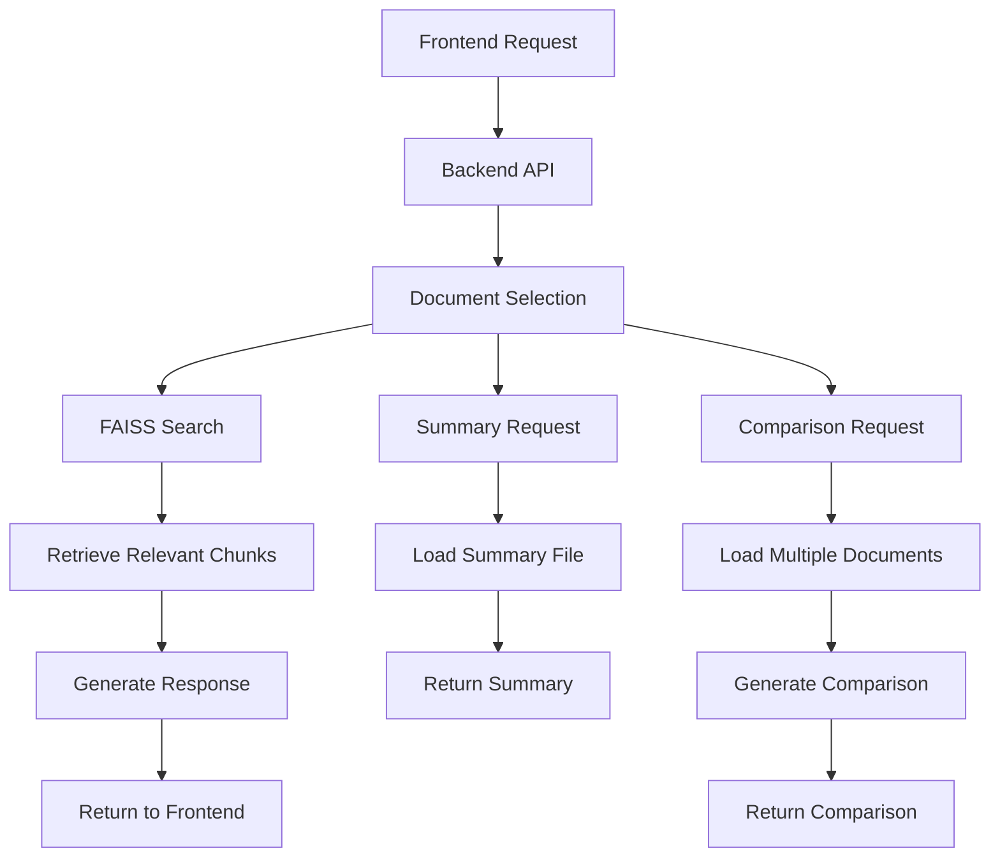
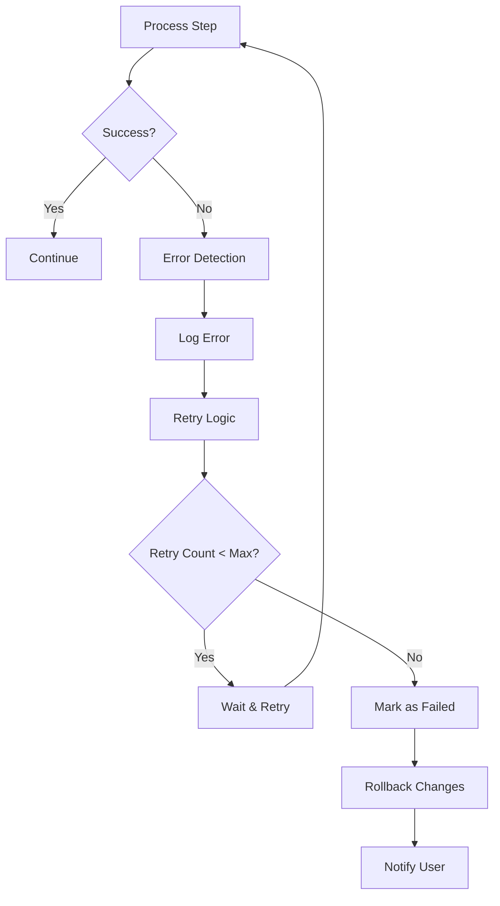
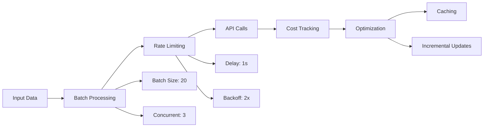
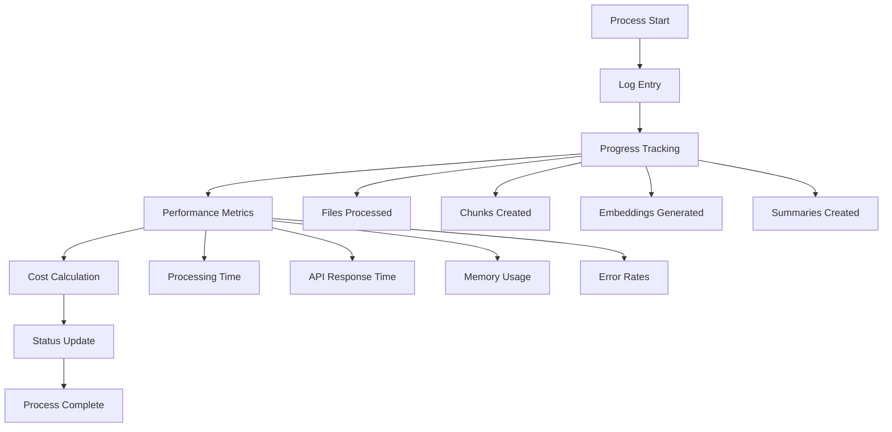

# Regulatory Document Processing Flow

**Author:** Fanxing Bu  
**Last Updated:** 2025-01-27

---

## Overview

This document describes the complete processing flow for regulatory documents in the RegHealth Navigator system, from initial download through final summary generation.

---

## Complete Processing Pipeline



---

## Detailed Process Flow

### Phase 1: Document Discovery & Download


**Steps:**
1. **Regulation Discovery**: Query Federal Register API for new regulations
2. **Program Classification**: Automatically detect MPFS, HOSPICE, or SNF regulations
3. **File Validation**: Check if files already exist in local storage
4. **Download Process**: Download XML files to appropriate directories
5. **File Organization**: Organize by program type and year

### Phase 2: Text Chunking



**Steps:**
1. **XML Parsing**: Parse XML structure to identify sections and content
2. **Text Extraction**: Extract clean text content from XML elements
3. **Chunk Creation**: Split text into manageable chunks (typically 500-1000 tokens)
4. **Metadata Addition**: Add source file, section information, and chunk index
5. **Storage**: Save chunks with metadata to `rag_data/chunks.json`

### Phase 3: Embedding Generation



**Steps:**
1. **Chunk Loading**: Load pre-processed chunks from storage
2. **Batch Processing**: Group chunks into batches for efficient API calls
3. **Embedding Generation**: Call OpenAI API to generate embeddings
4. **Vector Storage**: Store embeddings in FAISS index
5. **Index Management**: Update and maintain search index

### Phase 4: Summary Generation



**Steps:**
1. **Chunk Loading**: Load all chunks for a specific document
2. **Batch Processing**: Process chunks in batches of 20 for cost efficiency
3. **Content Analysis**: Extract topics, key changes, and stakeholder impacts
4. **Summary Synthesis**: Combine batch results into comprehensive summary
5. **Format Generation**: Generate human-readable Markdown format
6. **Storage**: Save to `summary_outputs/` directory

---

## File Organization

```
RegHealth-Navigator/
├── data/                          # Source XML files
│   ├── MPFS/
│   │   ├── 2024_MPFS_final_2023-24184.xml
│   │   └── 2023_MPFS_final_2022-23873.xml
│   ├── HOSPICE/
│   │   └── 2023_HOSPICE_final_2022-16457.xml
│   └── SNF/
│       └── 2024_SNF_final_2023-16249.xml
├── rag_data/                      # Processed data
│   ├── chunks.json               # Text chunks with metadata
│   ├── faiss_index/              # FAISS search index
│   └── metadata.json             # Index metadata
└── summary_outputs/              # Generated summaries
    ├── 2024_MPFS_final_2023-24184.md
    ├── 2024_MPFS_final_2023-24184.json
    └── batch_cache/              # Batch processing cache
        └── 2024_MPFS_final_2023-24184/
            ├── batch_0_xxxxx.json
            └── batch_index.json
```

---

## API Integration Flow



---

## Error Handling & Recovery



**Error Handling Strategies:**
1. **Retry Logic**: Automatic retry for transient failures
2. **Rollback**: Atomic operations ensure data consistency
3. **Logging**: Comprehensive error logging for debugging
4. **Graceful Degradation**: Continue processing other files if one fails

---

## Cost Optimization



**Cost Optimization Features:**
1. **Batch Processing**: Group operations to minimize API calls
2. **Rate Limiting**: Prevent API rate limit violations
3. **Caching**: Cache results to avoid redundant processing
4. **Incremental Updates**: Only process new or modified files
5. **Cost Tracking**: Monitor and report API usage costs

---

## Performance Metrics

| Phase | Typical Duration | Cost per Document | Success Rate |
|-------|------------------|-------------------|--------------|
| Download | 30-60 seconds | $0.00 | 99% |
| Chunking | 10-30 seconds | $0.00 | 99% |
| Embedding | 2-5 minutes | $0.01-0.05 | 95% |
| Summary | 3-8 minutes | $0.02-0.10 | 90% |

**Factors Affecting Performance:**
- Document size and complexity
- API response times
- Network connectivity
- System resources
- Batch processing efficiency

---

## Monitoring & Logging



**Monitoring Features:**
1. **Real-time Progress**: Track processing status in real-time
2. **Performance Metrics**: Monitor processing time and efficiency
3. **Cost Tracking**: Track API usage and costs
4. **Error Monitoring**: Identify and log processing failures
5. **System Health**: Monitor system resources and availability

---

## Conclusion

This processing pipeline provides a robust, cost-effective, and scalable solution for handling regulatory documents. The incremental approach ensures efficient resource utilization while maintaining data consistency and system reliability.

The modular design allows for easy maintenance, debugging, and future enhancements while providing comprehensive monitoring and error handling capabilities. 